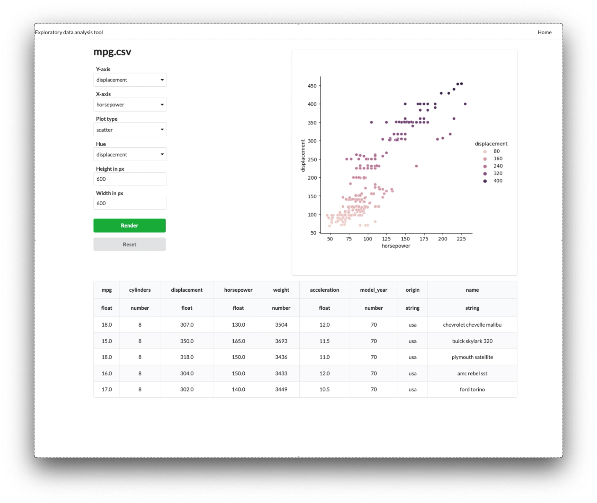

# EDAT - Exploratory data analysis tool

_Disclaimer: This project was created for purely educational purposes._

EDAT was created for intranet usage with a team of people in mind whose python
knowledge level does not yet allow them to use common python libraries used for 
such purposes these days. That's where EDAT steppes in, it provides users without 
any programming experience ability to perform statistical data analysis through 
the hi-level web interface. 

This project is much more complex than any of the previous projects covered in CS50 Web course. 
It uses complex Architecture pattern, asyncronous task scheduling functionality, python static 
type checking, containerization, separate API app, asyncronous tests implementation and 
data-transfer objects for app tiers communications, and frontend VueJS app implemented from scratch.


### The normal workflow looks like this:



* Create an account and login into the service
* Upload a CSV file to the service
  * verify CSV dialect (separator, quote character, etc...)
  * verify data column types (number, string, etc...)
* Save the file to the service
* Open saved dataset and perform data analysis with selected options

Please see [video demo](https://youtu.be/FUixs3kvxKI) for more details

## Implementation details

### Project Libraries

* [Seaborn](https://seaborn.pydata.org) - plot rendering (there are 14+ plot types available)
* [Django](https://www.djangoproject.com) - backend ORM, login management, static pages/files
  * dockerized [PostgreSQL](https://www.postgresql.org) container as database 
* [FastAPI](https://fastapi.tiangolo.com) - API implementation
* [Vue.js](https://vuejs.org) - main frontend
* [Celery](https://docs.celeryproject.org) - plot render task management
  * dockerized [RabbitMQ](https://www.rabbitmq.com) container for task queue
* [Pydantic](https://pydantic-docs.helpmanual.io) - Controllers and Services communicate using pydantic
DTO (data-transfer object) models which enforce data validation using type hints at runtime.
  
### Multi-Tier Architecture
The Backend of this project uses the [3-Tier architecture pattern](https://en.wikipedia.org/wiki/Multitier_architecture#Three-tier_architecture)
where each tier (or layer) is isolated from the others, can be 
developed and maintained separately or even reimplemented and swapped with i
minimal efforts. 

Source: [Wikipedia.com](https://en.wikipedia.org/wiki/Multitier_architecture#/media/File:Overview_of_a_three-tier_application_vectorVersion.svg)

In this project these tiers are represented by:

**Controllers**: A set of single-purpose functions triggered by user's request 
to a certain api route and passing provided parameters to the logic tier 

**Services:**: The engine of the app which contains all the logic, decisions making, 
processing and task scheduling.   

**Database**: The communication with SQL database is performed using 
Django ORM

### Project File Structure
```
.
├── apps/   <- Django app installations
│   ├── datasets/   <- API app
│   │   ├── ...
│   │   ├── controllers/  <- Representation Tier: Controllers
│   │   │   ├── ...
│   │   │   └── datasets.py  <- API route functions
│   │   ├── dtos/         
│   │   │   ├── ...
│   │   │   └── datasets.py  <- Pydantic DTO models 
│   │   ├── migrations/
│   │   ├── models/       <- Data Tier: Database
│   │   │   ├── ...
│   │   │   └── datasets.py  <- Django ORM models except for User model (Data Tier)
│   │   ├── services/     <- Logic Tier: Services
│   │   │   ├── ...
│   │   │   └── datasets.py  <- Application logic, decisions, task scheduling
│   │   ├── tasks.py      <- Celery tasks for plot rendering
│   │   └── ...
│   └── visualizer/   <- Frontend app, Auth, Admin panel
│       ├── ...
│       ├── migrations/
│       ├── static/       <- VueJS app, CSS
│       │   └── visualizer/  
│       │       ├── app.js   <- VueJS app initialization
│       │       ├── vue  <- VueJS components
│       │       └── css  <- Sass generated CSS
│       ├── templates/   <- Django + VueJS templates
│       │   └── visualizer/  
│       │       ├── index.html   <- index page Django template which loads vue templates
│       │       ├── _routes.html <- vue-router route decision 
│       │       ├── _routes.html <- Django template which loads vue templates
│       │       ├── _variables.html <- js variables passed using django template engine
│       │       ├── vue-<component_name>.html  <- VueJS component templates
│       │       └── css  <- Sass generated CSS
│       ├── models.py    <- User model
│       ├── tests.py
│       ├── urls.py       <- Urls for the project's frontend
│       └── views.py      <- Login, Logout, Index views
├── base/
│   ├── asgi.py       <- FastAPI install
│   ├── celery.py     <- Celery install
│   ├── settings.py   <- Django and Celery settings
│   ├── test_settings.py    <- Django testing settings
│   ├── urls.py
│   └── wsgi.py
├── helpers/
│   ├── auth_tools.py   <- Auth helpers
│   ├── csv_tools.py    <- CSV handling
│   ├── exceptions.py   <- Exceptions used in the project
│   ├── file_tools.py   <- Files handling
│   └── plot_tools.py   <- Plots render 
├── docs/ 
├── frontend/       <- Frontend development 
├── create_env.sh   <- Script to generate .env file
├── Dockerfile      <- Docker build instructions
├── docker-compose.yml  <- App containerization instructions
├── ...
├── media/    <- Django MEDIA_ROOT directory
├── requirements.txt
└── tests/
    ├── conftest.py   <- Tests conficuration
    ├── ...
    ├── test_api/   <- Api test cases
    └── test_models/    <- Models test cases
```

### Code Correctness

* Linters: [Pyright](https://github.com/microsoft/pyright), [Pylint](https://www.pylint.org), [Flake8](http://flake8.pycqa.org/)
* Static Type-checking: [Pyright](https://github.com/microsoft/pyright), [mypy](http://mypy-lang.org)
* Formatters: [autopep8](https://github.com/hhatto/autopep8), [yapf](https://github.com/google/yapf)

### Routing

* The Django app is available at `/` (e.g. [http://localhost:8000/django/admin/]())
* The FastAPI app is available at `/api` (e.g. [http://localhost:8000/api/dataset/]())

## Installation

```shell
$ git clone https://github.com/igorvoltaic/edat
$ cd edat/
$ python -m venv venv
$ source venv/bin/activate
$ pip install -r requirements.txt
$ echo "SECRET_KEY=installation_secret" > .env
$ source venv/bin/activate
$ ./manage.py migrate
$ ./manage.py createsuperuser 
```

## Running the App
To run this app you will need to have Docker installed. 
Please check out [Docker documentation](https://docs.docker.com/get-docker/) for more info.  

Before start generate `.env` file
```shell
$ bash create_env.sh
```

Debug mode:
```shell
~$ docker-compose up -d db rabbitmq

~$ celery -A base worker -l DEBUG
~$ uvicorn base.asgi:app --debug
```

Normal:
```sh
$ docker-compose up -d 
```
Visit [http://localhost:8000]() to see the app

## Testing

Testing is implemented using pytest. Run the tests like this:
```shell
$ cd ./tests
$ pytest
```

## Author

Created from scratch by [Igor Voltaic](https://github.com/igorvoltaic) in 2020-2021 for educational purposes
